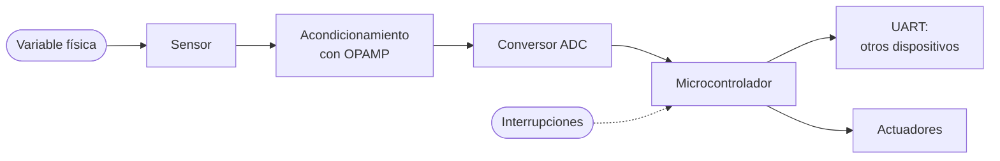

# ⚡ Circuitos eléctricos y microcontroladores

**Universidad Militar Nueva Granada · Ingeniería Informática**

¡Bienvenido a la asignatura! Antes de convertirse en información, muchos datos nacen como una variable física: una temperatura, las revoluciones de un motor, la velocidad del viento. En este curso aprenderás a capturar esas variables con circuitos electrónicos, a acondicionarlas con amplificadores operacionales y a procesarlas con un microcontrolador, para completar la cadena que va del mundo físico al dato útil.

> **Laboratorio interactivo:** abre los bancos de prueba del curso en tu navegador
> 👉 `https://TU-USUARIO.github.io/NOMBRE-DEL-REPOSITORIO/`

---

## 📋 Ficha de la asignatura

| | |
|---|---|
| **Asignatura** | Circuitos eléctricos y microcontroladores |
| **Código** | 101215 |
| **Semestre** | Quinto |
| **Créditos académicos** | 3 |
| **Prerrequisitos** | Ninguno |
| **Correquisitos** | Ninguno |
| **Docente y coordinador de área** | Andrés Felipe Sánchez Cristo |

## 🧭 ¿Por qué esta asignatura?

Es el paso que sigue a Circuitos digitales y una herramienta indispensable para asignaturas como Señales y sistemas. Te da la capacidad de gestionar datos obtenidos por hardware para que, de manera automática y embebida, se transformen en información útil: el principio fundamental del ingeniero informático.



## 🎯 Objetivo general

Generar las competencias necesarias para analizar y diseñar circuitos acondicionadores de señal con amplificadores operacionales, así como su implementación en proyectos que utilicen microcontroladores.

**Competencia global.** Integra el hardware y el software como herramientas tecnológicas adecuadas para mantener los sistemas de información de la organización.

**Competencias específicas**

1. Diseña acondicionadores de señal basados en OPAMP.
2. Aprende las bases para analizar y diseñar sistemas de control basados en microcontroladores.
3. Aprende las bases para comunicar dos o más microcontroladores y su interacción con sensores y actuadores.

## 🗓️ Cronograma

| Semana | Tema | Trabajo independiente |
|:---:|---|---|
| 1 | Aspectos previos de la electrónica análoga | |
| 2 | Análisis del amplificador operacional | Actividad complementaria 1 |
| 3 | Amplificador operacional con realimentación | **Primer parcial** |
| 4 | Aplicaciones del OPAMP | |
| 5 | Microcontroladores: arquitectura y composición interna | Actividad complementaria 2 |
| 6 | Microcontroladores: programación | **Segundo parcial** |
| 7 | Microcontroladores: módulo UART | |
| 8 | Microcontroladores: módulo ADC | Actividad complementaria 3 |
| 9 | Microcontroladores: interrupciones | **Examen final** |

## 📊 Sistema de evaluación

| Corte | Actividad | Porcentaje |
|---|---|:---:|
| **Primero** | Primera actividad | 15 % |
| | Primer parcial | 15 % |
| **Segundo** | Segunda actividad | 15 % |
| | Segundo parcial | 15 % |
| **Tercero** | Tercera actividad | 20 % |
| | Examen final | 20 % |
| | **Total** | **100 %** |

En cada entrega se evalúa el cumplimiento de las tareas, la escritura y redacción, la ortografía, la congruencia de los documentos y la lectura previa del material.

## 🧪 Laboratorio interactivo

El archivo [`index.html`](index.html) de este repositorio reúne cuatro bancos de prueba que siguen el recorrido de una señal, desde el sensor hasta el microcontrolador. No requiere instalar nada: funciona en cualquier navegador.

| Banco de prueba | Semanas | Qué puedes hacer |
|---|:---:|---|
| **Amplificador operacional** | 2 a 4 | Elegir la configuración (inversor, no inversor o seguidor), cambiar las resistencias y ver en el osciloscopio la ganancia y la saturación. |
| **Sensor y conversor ADC** | 8 | Acondicionar un sensor de temperatura de 10 mV/°C y ver cómo los bits y el voltaje de referencia determinan la precisión de la lectura. |
| **Comunicación UART** | 7 | Escribir un texto y observar la trama de cada carácter: bit de inicio, datos, paridad y parada. |
| **Interrupciones** | 9 | Comparar la lectura de un pulsador por sondeo y por interrupción, y contar cuántas pulsaciones se pierden. |

**Retos sugeridos**

1. En el amplificador inversor, con una entrada de 1 V y alimentación de ±12 V, ¿cuál es la mayor ganancia que no recorta la señal?
2. Diseña la cadena de medición para leer de 0 a 100 °C con un error menor que 0,1 °C. ¿Qué ganancia, referencia y número de bits necesitas?
3. Envía la letra `A` con paridad par y luego con paridad impar. ¿Qué bit cambia y por qué?
4. En modo sondeo, da diez toques cortos al pulsador. ¿Cuántos detecta el programa? Repite con interrupción y explica la diferencia.

## 📚 Bibliografía

1. Villaseñor, J. R. y Hernández, F. A. (2013). *Circuitos eléctricos y aplicaciones digitales*. México: Pearson.
2. Boylestad, R. L. y Nashelsky, L. (2009). *Electrónica: teoría de circuitos y dispositivos electrónicos*. México: McGraw-Hill.
3. Dorf, R. y Svoboda, J. (2007). *Circuitos eléctricos* (6.ª ed.). México: Alfaomega.
4. Angulo Usategui, J. M. y Angulo Martínez, I. (1999). *Microcontroladores PIC*. Madrid: McGraw-Hill.
5. Reyes, C. A. (2006). *Microcontroladores PIC: programación en Basic*. Quito: Rispergraf.
6. Caprile, S. (2012). *Desarrollo con microcontroladores ARM Cortex-M3*. Puntolibro.

**Material complementario en el aula virtual:** glosario, preguntas de repaso, material multimedia, enlaces en la red y curso virtual.

## 🚀 Cómo usar este repositorio

```
.
├── README.md     ← este documento
└── index.html    ← laboratorio interactivo (HTML, CSS y JavaScript en un solo archivo)
```

**Para verlo en tu computador:** descarga el repositorio y abre `index.html` con doble clic.

**Para publicarlo con GitHub Pages:** entra a *Settings → Pages*, en *Source* elige *Deploy from a branch*, selecciona la rama `main` y la carpeta `/ (root)`, y guarda. En un par de minutos la página queda disponible en `https://TU-USUARIO.github.io/NOMBRE-DEL-REPOSITORIO/`.

---

<sub>Material de apoyo académico. Los modelos del laboratorio son ideales y simplifican los componentes reales.</sub>
